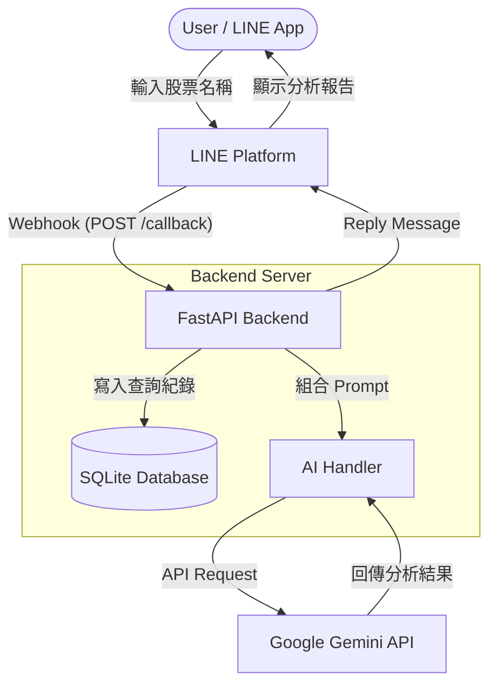

# 系統架構設計文件 (ARCHITECTURE)

## 1. 系統概述
本專案為一個基於 FastAPI 構建的 LINE Bot 應用程式，主要功能為提供使用者「AI 股票分析服務」。系統接收來自 LINE 平台的 Webhook 事件，將使用者的文字訊息（股票名稱或代號）傳送至 Google Gemini API 進行 AI 分析，並將分析結果即時回傳給使用者。同時，所有的查詢紀錄將儲存於本地端的 SQLite 資料庫中，以供後續追蹤。

## 2. 系統架構圖
以下為系統的整體架構與資料流向圖：



## 3. 核心技術棧
- **後端框架**: Python 3, FastAPI (提供非同步的高效能 Web Server，適合處理 Webhook)
- **通訊平台 API**: `line-bot-sdk-python` v3 (處理 LINE Webhook 驗證與訊息回覆)
- **AI 服務**: Google Gemini API (提供自動化的股票基本面與風險分析)
- **資料庫**: SQLite (輕量級關聯式資料庫，用於紀錄對話日誌，免去額外啟動 DB Server 的麻煩)
- **伺服器/反向代理**: Uvicorn (ASGI server), ngrok (用於本地開發測試，將內網 port 曝露給 LINE Webhook)

## 4. 核心元件說明

### 4.1 LINE Webhook 接收器 (`/callback`)
- **功能**: 作為與 LINE Platform 溝通的唯一入口點。
- **職責**:
  - 接收 HTTP POST 請求。
  - 使用 `LINE_CHANNEL_SECRET` 驗證 HTTP Header 中的 `X-Line-Signature`，確保請求合法且未被竄改。
  - 將驗證通過的事件交由 Event Handler 進行分類處理。

### 4.2 事件處理器 (Event Handler)
- **功能**: 解析不同的 LINE 事件類型。
- **職責**:
  - 攔截 `MessageEvent` 且訊息類型為 `TextMessageContent` 的事件。
  - 過濾非文字訊息（如貼圖、圖片等），並回傳防呆提示。
  - 提取使用者的 `user_id` 與 `text` (股票名稱)，傳遞給下游服務。

### 4.3 業務邏輯與服務層 (Service Layer)
- **Database Service (資料庫服務)**: 負責與 SQLite 互動，將 `user_id`, `text`, 和當下時間寫入 `chat_logs` 資料表。
- **AI Analysis Service (AI 分析服務)**:
  - 讀取環境變數 `GEMINI_API_KEY`。
  - 依照 PRD 規範，組合系統指令（System Prompt）與使用者輸入，呼叫 Gemini 模型。
  - 處理 API 呼叫的例外狀況（如超時或網路錯誤），確保系統不會崩潰，並回傳友善的錯誤訊息給使用者。

## 5. 資料庫設計 (Database Schema)
使用本地 SQLite 作為資料儲存方案，預設檔案名稱可為 `users.db`。

**Table: `chat_logs`**
- `id` (INTEGER, Primary Key, Auto Increment): 紀錄流水號
- `user_id` (VARCHAR): LINE 平台提供的使用者唯一識別碼
- `message_text` (VARCHAR): 使用者輸入的查詢文字（股票代號或名稱）
- `timestamp` (DATETIME): 接收到訊息並寫入資料庫的時間戳記

## 6. 目錄結構
```
your-repo/
├── .agents/
│   └── skills/           # AI 輔助開發的提示詞與規範檔案 (Skill)
├── docs/
│   ├── PRD.md            # 產品需求文件
│   └── ARCHITECTURE.md   # 系統架構文件 (本文件)
├── screenshots/          # 存放測試截圖
├── app.py                # 主程式 (FastAPI + LINE Bot + Gemini + SQLite)
├── requirements.txt      # 專案 Python 依賴套件清單
├── .env.example          # 環境變數範本 (不含真實金鑰)
└── README.md             # 專案說明與作業報告
```

## 7. 部署與執行流程
本系統針對本地開發與測試設計：
1. 建立並啟動 Python 虛擬環境 (`.venv`)。
2. 開發者於本地啟動 FastAPI 伺服器 (`uvicorn app:app --reload`)，服務預設運行於 port 8000。
3. 另開終端機使用 `ngrok http 8000` 建立安全隧道，獲取公網 HTTPS URL。
4. 將獲取的 HTTPS URL 加上 `/callback` 註冊至 LINE Developers Console 的 Webhook URL 欄位。
5. 於 LINE Developers Console 進行「Verify」驗證，成功後即可掃描 QR Code 加機器人為好友進行測試。
