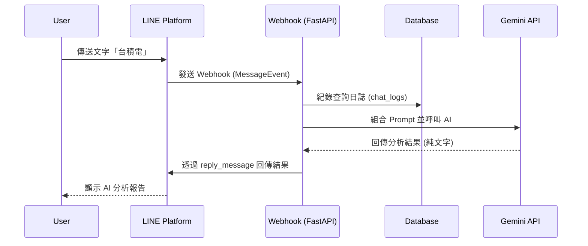

# 產品需求文件 (PRD)：AI 股票分析 LINE Bot

## 1. 專案簡介 (Overview)
本專案旨在打造一個輕量化、即時的 LINE 聊天機器人。目標受眾為一般股票投資人與投資新手。透過整合 LINE Messaging API 與 Gemini AI 模型，讓使用者只需在聊天室輸入「股票名稱」或「股票代號」，即可獲得該股票的精簡專業分析報告，藉此降低獲取投資洞察的門檻。

## 2. 使用者故事 (User Stories)
1. **身為一名投資新手**，我希望能在 LINE 對話中輸入股票代號（如 2330），立刻獲得 AI 對該股票的基本面與近期趨勢分析，幫助我快速了解這間公司。
2. **身為一名忙碌的上班族**，我希望能輸入「分析 聯發科」，並在十幾秒內收到一段重點摘要與風險提示，讓我不用花大量時間爬文。
3. **身為系統管理員**，我希望系統能紀錄使用者的查詢歷史，以便未來進行使用量分析或除錯。

## 3. 系統流程 (User Flow)
以下為使用者送出訊息後，系統處理的完整資料流程：

## 4. 功能需求 (Functional Requirements)

### 4.1 LINE Webhook 接收與解析
- 系統必須提供 `/callback` 路由，接受 POST 請求。
- 驗證 `X-Line-Signature`，確保請求來自 LINE 官方。
- 解析 `MessageEvent` 中的 `TextMessageContent`，獲取使用者輸入的字串。

### 4.2 Gemini API 整合
- 擷取使用者文字後，套用以下 **System Prompt / 指令範本** 呼叫 Gemini 模型：
  > 「你是一位專業的金融分析師。請針對使用者詢問的股票『{user_input}』進行 300 字以內的精要分析。請包含：1. 近期概況與趨勢 2. 產業亮點 3. 潛在風險。請直接給出分析，不要有開場白。」
- 取得 Gemini 回傳的純文字內容。

### 4.3 錯誤處理機制 (Error Handling)
- **非文字訊息**：若使用者傳送貼圖或圖片，回傳「目前僅支援文字股票查詢喔！請輸入股票名稱或代號。」
- **API 呼叫失敗/超時**：若 Gemini API 發生異常，回傳「抱歉，目前 AI 分析師正在休息中，請稍後再試。」

## 5. 非功能需求 (Non-Functional Requirements)

### 5.1 效能與時間限制 (Timeout Constraints)
- **LINE `reply_token` 限制**：LINE 規定 Webhook 必須盡快回應，且 `reply_token` 的時效為 1 分鐘。
- **處理方案**：Gemini Prompt 已限制回答在 300 字以內，預期回應時間約為 5~15 秒，以確保能在 `reply_token` 失效前回傳訊息。若未來考慮更複雜的分析（耗時超過一分鐘），需改用非同步的 `PushMessage`。

### 5.2 環境變數與安全性
- 開發與正式環境均需使用 `.env` 檔案管理敏感資訊，不得將金鑰寫死於程式碼中。
- 必要的環境變數清單：
  - `LINE_CHANNEL_SECRET`
  - `LINE_CHANNEL_ACCESS_TOKEN`
  - `GEMINI_API_KEY`

## 6. 資料需求 (Data Requirements)

為了具備基本的操作追蹤能力（並符合作業規範），系統將使用輕量級的 SQLite 作為關聯式資料庫。

### 6.1 資料表結構 (Schema): `chat_logs`
用於紀錄使用者的查詢活動。

| 欄位名稱 | 資料型別 | 說明 |
| :--- | :--- | :--- |
| `id` | INTEGER | 主鍵 (Primary Key, Auto Increment) |
| `user_id` | VARCHAR | LINE 使用者的 User ID |
| `message_text` | VARCHAR | 使用者輸入的查詢文字（股票名稱） |
| `timestamp` | DATETIME | 查詢發生的時間 |

*(備註：每次收到文字訊息後，在呼叫 Gemini 之前或之後，使用 SQLite 寫入一筆紀錄。)*
